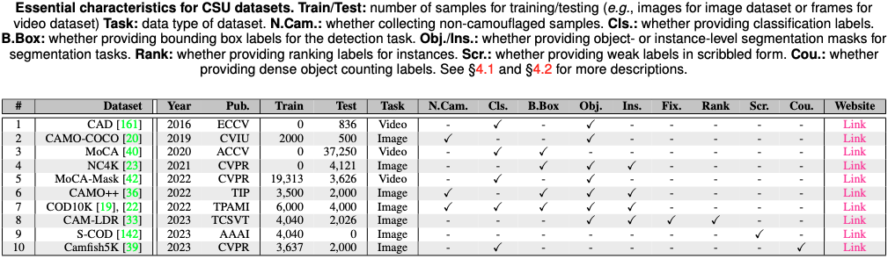

# Advances in Deep Concealed Scene Understanding

This repository contains a collection of research papers, an evaluation toolbox, and benchmarking results for the task of concealed object segmentation (COS) in images. Besides, to evaluate the generalizability of COS approaches, we re-organize a concealed defect segmentation dataset named CDS2K.

- Paper link: [arXiv](https://arxiv.org/abs/2304.11234)
- This project is under construction. Contributions are welcome! If you would like to contribute to this repository, please submit a pull request.

## Table of Contents

- [Advances in Deep Concealed Scene Understanding](#advances-in-deep-concealed-scene-understanding)
  - [Table of Contents](#table-of-contents)
  - [CSU Background](#csu-background)
  - [CSU Taxonomy](#csu-taxonomy)
  - [CSU Survey](#csu-survey)
  - [CSU Benchmark](#csu-benchmark)
  - [Defect Segmentation Dataset -- CDS2K](#defect-segmentation-dataset----cds2k)
  - [Citation](#citation)

## CSU Background

Concealed scene understanding (CSU) is a hot computer vision topic aiming to perceive objects with camouflaged properties. The current boom in its advanced techniques and novel applications makes it timely to provide an up-to-date survey to enable researchers to understand the global picture of the CSU field, including both current achievements and major challenges. 

      
    <em> 
    Figure 1: Sample gallery of concealed scenarios. (a-d) show natural animals. (e) depicts a concealed human in art. (f) features a synthesized ``lion''.
    </em>

This paper makes four contributions:
- For the first time, we present **a comprehensive survey** of the deep learning techniques oriented at CSU, including a background with its taxonomy, task-unique challenges, and a review of its developments in the deep learning era via surveying existing datasets and deep techniques. 
- For a quantitative comparison of the state-of-the-art, we contribute **the largest and latest benchmark** for Concealed Object Segmentation (COS). 
- To evaluate the transferability of deep CSU in practical scenarios, 
we re-organize **the largest concealed defect segmentation dataset** termed CDS2K  with the hard cases from diversified industrial scenarios, on which we construct a comprehensive benchmark.
- We **discuss open problems and potential research directions** for this community.

## CSU Taxonomy

We introduce a taxonomy of seven popular CSU tasks. Please refer to Section 2.1 of our paper for more details.
- Five of these are image-level tasks: (a) concealed object segmentation (COS), (b) concealed object localization (COL), (c) concealed instance ranking (CIR), (d) concealed instance segmentation (CIS), and (e) concealed object counting (COC). 
- The remaining two are video-level tasks: (f) video concealed object segmentation (VCOS) and (g) video concealed object detection (VCOD). 

We illustrate each task with its corresponding annotation visualization. 

      
    <em> 
    Figure 2: Illustration of representative CSU tasks.
    </em>

## CSU Survey

We recap the latest image-based research that includes 50 papers. 

      
    <em> 
    Table 1: Essential characteristics of reviewed video-level CSU methods.
    </em>

We also review recent nine video-based research

      
    <em> 
    Table 2: Essential characteristics of reviewed video-level CSU methods.
    </em>

The following are ten datasets collected for several CSU-related tasks.

      
    <em> 
    Table 3: Essential characteristics of reviewed video-level CSU methods.
    </em>

## CSU Benchmark

Our benchmarking is built on COS tasks since this topic is relatively well-established and offers a variety of competing approaches. **WHAT DO WE PROVIDE HERE?**

- First, we provide a one-key [evaluation toolbox](https://github.com/DengPingFan/CSU/tree/main/cos_eval_toolbox) for CSU. Please the follow instructions and then you will get the results.
- Second, we run COS approaches on three popular benchmarks (CAMO, NC4K, and COD10K) and organize them into the standard format (*png). The collection of these prediction masks is public [here (OneDrive, 4.82GB)](https://anu365-my.sharepoint.com/:u:/g/personal/u7248002_anu_edu_au/Edk5mzHO5JNMv0LHDFBdTq4Bgrg_wmsmYg9hjOzh6-nAjw?e=xdVrT4) for convenient research.
- The benchmark results on nine evaluation metrics are reported in the next three tables. You can find the text file [here](https://github.com/DengPingFan/CSU/tree/main/cos_eval_toolbox/output_COS).

      
    <em> 
    Table 4: Quantitative comparison of CAMO testing set.
    </em>

      
    <em> 
    Table 5: Quantitative comparison on NC4K testing set.
    </em>

      
    <em> 
    Table 6: Quantitative comparison of COD10K testing set.
    </em>

- Lastly, we provide the attribute-based analyses on the COD10K dataset

      
    <em> 
    Figure 3: Qualitative results of ten COS approaches. For more descriptions of visual attributes in each column refer to Section 5.6 of the paper.
    </em>

## Defect Segmentation Dataset -- CDS2K

We organize a concealed defect segmentation dataset ([download, 159MB](https://anu365-my.sharepoint.com/:u:/g/personal/u7248002_anu_edu_au/EaInvU0siBNJvn6owmkbxbkBROwCGGt0ZUHmSj31XtaMPQ?e=wK6s9e)) from the five well-known defect segmentation databases. As shown in Figure 4, we present five sub-databases: (a-l) MVTecAD, (m-o) NEU, (p) CrackForest, (q) KolektorSDD, and (r) MagneticTile. The defective regions are highlighted with red rectangles. (Top-Right) Word cloud visualization of CDS2K. (Bottom) The statistic number of positive/negative samples of each category in our CDS2K.

      
    <em> 
    Figure 4: Sample gallery of our CDS2K. 
    </em>

The average ratio of defective regions for each category is presented in Table 7, which indicates that most of the defective regions are relatively small

      
    <em> 
    Table 7: Sample gallery of our CDS2K. 
    </em>

Next, we report the quantitative comparison on the positive samples of CDS2K. Kindly download the result map on [OneDrive Link](https://anu365-my.sharepoint.com/:u:/g/personal/u7248002_anu_edu_au/EfkiOnKlEIJKotJwXTyBl64B39ZF7b38weJFQwMFr98kIw?e=uCWFUa).

      
    <em> 
    Table 8: SQuantitative comparison on the positive samples of CDS2K.
    </em>

## Citation

Please cite our paper if you find the work useful:

    @article{fan2023csu,
      title={Advances in Deep Concealed Scene Understanding},
      author={Fan, Deng-Ping and Ji, Ge-Peng and Xu, Peng and Cheng, Ming-Ming and Sakaridis, Christos and Van Gool, Luc},
      journal={arXiv preprint:2304.11234},
      year={2023}
    }
